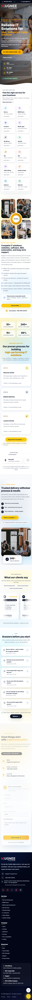
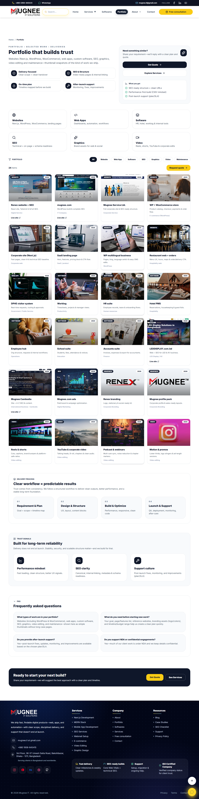
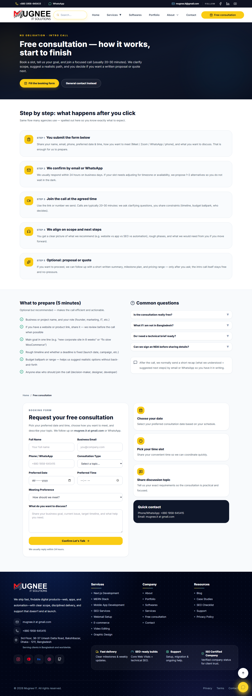
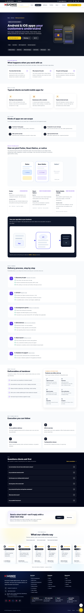

# Mugnee IT Solution — Digital Presence & Services Platform

**A modern, client-focused web experience that presents software development, web services, and digital growth offerings with clarity, credibility, and a streamlined path to engagement.**

**[View the visual tour →](#visual-tour-live-product)**

---

## Overview

This initiative represents the public digital flagship for **Mugnee IT Solution** — designed for businesses that need a trustworthy partner for software, web platforms, and related digital services. The experience emphasizes clear service positioning, social proof, and simple ways to start a conversation, so visitors quickly understand *what you offer*, *who it is for*, and *how to take the next step*.

Rather than overwhelming technical detail, the focus is on outcomes: stronger visibility, reliable delivery, and solutions aligned with real business workflows.

---

## Key Features

- **Service-first storytelling** — Organized presentation of practice areas (modern web stacks, e‑commerce, SEO, creative production, automation, and more) so prospects can self-qualify.
- **Trust and credibility** — Testimonials, partner signals, and structured content that support decision-making for B2B buyers.
- **Portfolio and proof** — Project highlights and supporting materials that demonstrate breadth and depth of delivery.
- **Content and discovery** — Blog and editorial-style pages that support ongoing engagement and search visibility.
- **Lead paths** — Contact and consultation scheduling flows that reduce friction between interest and a first conversation.
- **Polished, responsive experience** — Consistent layout, motion, and accessibility-minded patterns across desktop and mobile.

---

## Industry & Use Case

**Ideal for:** technology services firms, digital agencies, and B2B consultancies that sell software, web builds, marketing-adjacent services, or ongoing technical support.

**Typical use cases:** establishing a credible first impression online, supporting inbound sales with detailed service pages, showcasing case work, publishing thought leadership, and capturing qualified enquiries from global and regional markets.

---

## System Workflow (Visitor Journey)

1. **Arrive** — The visitor lands on a clear hero and immediate sense of brand and value proposition.
2. **Explore** — They browse services, industries, or proof points that match their needs.
3. **Validate** — They review testimonials, partners, FAQs, or portfolio items to build confidence.
4. **Deepen** — Optional reading via blog or long-form service pages answers specific questions.
5. **Act** — They submit a contact form or request a consultation to speak with your team.
6. **Follow-up** — Your team responds through your standard sales or support process (outside this showcase).

---

## Tech Stack

The production solution is built with contemporary, maintainable web technology:

| Area | Technologies |
| :--- | :--- |
| **Application framework** | Next.js (App Router) |
| **Interface** | React |
| **Language** | TypeScript |
| **Styling** | Tailwind CSS |
| **Motion & icons** | Framer Motion, Lucide |
| **Quality** | ESLint aligned with Next.js conventions |
| **Hosting-ready** | Static export–oriented delivery suitable for CDN and edge-friendly hosting |

*Stack reflects the delivered product; this repository intentionally omits implementation files.*

---

## Visual tour (live product)

A **two-column gallery** of the live experience at [mugneeit.com](https://mugneeit.com): each row pairs related views so visitors can compare at a glance. **Click any image** for the full-resolution capture.

<table>
  <tbody>
    <tr>
      <td align="center" valign="top" width="50%">
        
<strong>Homepage — hero &amp; positioning</strong>

        
        
Above the fold: brand, primary paths into services.

      </td>
      <td align="center" valign="top" width="50%">
        
<strong>Homepage — depth &amp; trust</strong>

        
        
Further down: services, process, supporting content.

      </td>
    </tr>
    <tr>
      <td align="center" valign="top" width="50%">
        
<strong>Projects — portfolio</strong>

        
        
Proof of delivery: case-style listings.

      </td>
      <td align="center" valign="top" width="50%">
        
<strong>Schedule consultation</strong>

        
        
Clear next step from interest to conversation.

      </td>
    </tr>
    <tr>
      <td align="center" valign="top" width="50%">
        
<strong>Service — Next.js</strong>

        
        
Modern web positioning &amp; structured narrative.

      </td>
      <td align="center" valign="top" width="50%">
        
<strong>Service — mobile app development</strong>

        
        
Breadth beyond web-only delivery.

      </td>
    </tr>
  </tbody>
</table>

  <a href="https://mugneeit.com"><strong>Open the live site → mugneeit.com</strong></a>

---

## Architecture (High Level)

At a conceptual level, the solution separates **public marketing surfaces**, **structured content** (services, projects, articles), and **lead capture** from **operational systems** (CRM, email, analytics) that you connect in production. Content is organized for SEO and navigation depth without exposing proprietary integrations or client data in a public repository.

---

## Source Code Notice

**The full application source code is maintained in a private environment.**  
This public repository exists solely as a **portfolio and capability showcase**. Source, configuration, build pipelines, and integration details are withheld to protect **security**, **intellectual property**, and **client confidentiality**. Engagement for audits, demos, or technical deep-dives happens under appropriate agreements.

---

## Company

**Mugnee IT Solution**

Website: [https://mugneeit.com](https://mugneeit.com)

---

## Work With Us

If you are evaluating a partner for **custom software**, **modern web platforms**, **digital marketing foundations**, or **ongoing technical support**, we welcome a conversation. Share your goals, timeline, and constraints — we will respond with a practical path forward.

**[Visit mugneeit.com](https://mugneeit.com)** to explore services and get in touch.

---

*This repository is a non-development showcase. It does not contain runnable application code, dependencies, or deployment configuration.*
