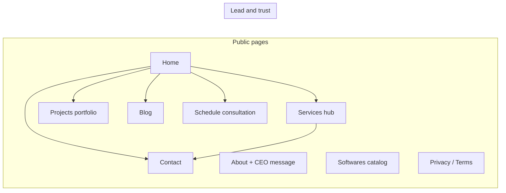

<p align="center">
  <a href="https://mugneeit.com" target="_blank" rel="noopener noreferrer">
    
  </a>
</p>

<h1 align="center">Mugnee IT — Company Website</h1>

<p align="center">
  <strong>Production-grade marketing site for Mugnee IT Solutions</strong><br />
  Software, web services, and digital growth — presented as a fast, SEO-aware Next.js experience.
</p>

<p align="center">
  <a href="https://mugneeit.com"></a>
  
  
  
  
</p>

---

## Table of contents

| | |
| :--- | :--- |
| **1.** | [What this project is](#what-this-project-is) |
| **2.** | [Highlights](#highlights) |
| **3.** | [Tech stack](#tech-stack) |
| **4.** | [Site map at a glance](#site-map-at-a-glance) |
| **5.** | [Repository layout](#repository-layout) |
| **6.** | [Getting started](#getting-started) |
| **7.** | [Environment variables](#environment-variables) |
| **8.** | [Scripts](#scripts) |
| **9.** | [Build and deploy](#build-and-deploy) |
| **10.** | [Content and data](#content-and-data) |
| **11.** | [SEO and discoverability](#seo-and-discoverability) |
| **12.** | [Production checklist](#production-checklist) |
| **13.** | [License and visibility](#license-and-visibility) |

---

## What this project is

**Mugnee IT** is the public-facing website for **Mugnee IT Solutions** — a Dhaka-based team building software, modern web platforms, and related digital services for businesses worldwide.

This repository ships:

- A **multi-section marketing homepage** (hero, services, process, testimonials, partners, FAQ, contact paths).
- A **deep services hub** with dedicated landing pages for practice areas (Next.js, MERN, SEO, Shopify, WordPress, Wix, web scraping, webmail, video editing, graphic design, lead generation, LinkedIn outreach, custom software, mobile apps, and more), including regional variants where relevant.
- **Portfolio / projects** with listing and detail pages driven from structured data.
- **Blog** listing and article pages, plus a lightweight **admin publish UI** that merges posts with a runtime JSON store.
- **Contact** and **schedule consultation** flows, **privacy** and **terms**, **about** (including CEO message), and a **software catalog** style page.
- **Polished UI**: responsive layout, motion (Framer Motion), icons (Lucide), shared UI primitives, header/footer, floating support entry, scroll-to-top, and site preloader.

Live production URL: **[https://mugneeit.com](https://mugneeit.com)**

---

## Highlights

| Area | What visitors get |
| :--- | :--- |
| **Positioning** | Clear service pillars, process steps, FAQs, and trust signals aligned with a B2B agency. |
| **Scale of content** | 80+ routed pages under `src/app` covering services, legal, blog, projects, and utilities. |
| **Performance mindset** | Static export–oriented build, unoptimized image mode suited to static/CDN hosting, trailing-slash URLs. |
| **Lead capture** | Contact enquiry and consultation scheduling components; email delivery wired via **Nodemailer** when SMTP env is set. |
| **Structured data** | Organization and LocalBusiness JSON-LD in the root layout for richer search results. |
| **Developer experience** | TypeScript, ESLint (Next config), optional Turbopack dev script, Windows-friendly `dev-safe` script for port cleanup. |

---

## Tech stack

| Layer | Choice |
| :--- | :--- |
| **Framework** | [Next.js](https://nextjs.org/) 16 (App Router) |
| **UI** | [React](https://react.dev/) 19 |
| **Language** | [TypeScript](https://www.typescriptlang.org/) |
| **Styling** | [Tailwind CSS](https://tailwindcss.com/) 3 + PostCSS + Autoprefixer |
| **Motion** | [Framer Motion](https://www.framer.com/motion/) |
| **Icons** | [Lucide React](https://lucide.dev/) |
| **Email (API route)** | [Nodemailer](https://nodemailer.com/) |
| **Fonts** | `next/font` — Inter + Poppins |

---

## Site map at a glance



**Core routes (examples — all use trailing slashes in production config):**

| Section | Typical paths |
| :--- | :--- |
| **Company** | `/`, `/about/`, `/about/ceo-message/`, `/contact/`, `/schedule-consultation/` |
| **Services** | `/services/` and nested hubs such as `/services/nextjs/`, `/services/mern-stack/`, `/services/seo/`, `/services/shopify/`, `/services/wordpress/`, `/services/wix/`, `/services/web-scraping/`, `/services/webmail/`, `/services/video-editing/`, `/services/graphic-design/`, `/services/frontend/`, `/services/software-solution/`, `/services/lead-generation/`, `/services/linkedin-setter/`, `/services/mobile-app-development/`, plus many sub-service URLs under each hub. |
| **Portfolio** | `/projects/`, `/projects/[slug]/` |
| **Blog** | `/blog/`, `/blog/[slug]/`, `/blog/admin/` |
| **Other** | `/softwares/`, `/privacy/`, `/terms/` |
| **API (dev / Node deployments)** | `POST /api/contact/` (enquiry email), `GET /api/blog-posts/` (returns seeded posts JSON for diagnostics) |

<details>
<summary><strong>Expand: service hubs included in the codebase</strong></summary>

- **Next.js** — business sites, Core Web Vitals, technical SEO, worldwide pages  
- **MERN stack** — API, auth/RBAC, dashboards, maintenance  
- **SEO** — local, on-page, technical, ecommerce, audits  
- **Shopify** — store setup, themes, speed, SEO  
- **WordPress / WooCommerce** — builds, speed, maintenance-focused pages  
- **Wix** — maintenance and related service pages  
- **Web scraping** — extraction, leads, sheets automation, regional pages  
- **Webmail** — setup, migration, SPF/DKIM/DMARC, deliverability  
- **Video editing** — corporate, YouTube, shorts/reels, podcasts  
- **Graphic design** — logo, banner, flyer, poster, packaging, label  
- **Frontend** — React, landing pages, UI/UX implementation, performance, BD/worldwide  
- **Software solution** — custom software, web apps, ERP/inventory, automation, internal systems  
- **Lead generation** and **LinkedIn setter** — dedicated long-form service pages  
- **Mobile app development** — dedicated hub page  

Dynamic catch-all **`/services/[slug]/`** ties into shared service data where applicable.

</details>

---

## Repository layout

```text
mugnee-it/
├── public/                 # Images, logos, hero assets, portfolio covers, PDFs, tech SVGs, favicons
├── scripts/
│   └── dev-safe.js         # Windows-friendly dev server helper (port + lock cleanup)
├── data/
│   └── blogPosts.runtime.json   # Runtime blog posts (merged at build/runtime with src data)
├── src/
│   ├── app/                # App Router: pages, layouts, sitemap, robots, API routes
│   ├── components/       # Header, footer, sections, forms, UI kit, illustrations
│   ├── data/             # services, projects, blog seed posts, FAQs
│   ├── lib/              # blog store, utilities
│   └── types/            # Shared TypeScript types
├── next.config.ts          # Static export, trailingSlash, images.unoptimized, remote patterns
├── tailwind.config.js
├── postcss.config.js
├── eslint.config.mjs
├── tsconfig.json
└── package.json
```

---

## Getting started

**Requirements:** Node.js **20+** (recommended) and npm.

```bash
git clone https://github.com/mugnee-it/Mugnee-IT.git
cd Mugnee-IT
npm install
```

Start the development server (uses `scripts/dev-safe.js` then Next with webpack):

```bash
npm run dev
```

Open **[http://localhost:3000](http://localhost:3000)** (or the port shown in the terminal).

Optional dev modes from `package.json`:

```bash
npm run dev:webpack    # next dev --webpack
npm run dev:turbo      # next dev --turbopack
```

---

## Environment variables

Create **`.env.local`** in the project root (never commit real secrets).

| Variable | Required | Purpose |
| :--- | :---: | :--- |
| `NEXT_PUBLIC_SITE_URL` | Recommended | Canonical site origin, e.g. `https://mugneeit.com` — used for sitemap and public URLs. |
| `SMTP_HOST` | For email | SMTP server hostname. |
| `SMTP_PORT` | Optional | Defaults to **587**; **465** uses implicit TLS. |
| `SMTP_USER` | For email | SMTP username. |
| `SMTP_PASS` | For email | SMTP password (spaces stripped in code). |
| `SMTP_FROM` | Optional | From header, e.g. `"Website Lead" <you@domain.com>`. |
| `CONTACT_RECIPIENT` | Optional | Inbox for contact form; defaults to `mugnee.it@gmail.com` in code if unset. |

If SMTP is not configured, the contact API responds with a clear **500** configuration message (see `src/app/api/contact/route.ts`).

---

## Scripts

| Command | Description |
| :--- | :--- |
| `npm run dev` | Dev server via `dev-safe.js` + Next (webpack). |
| `npm run dev:webpack` | Next dev with webpack explicitly. |
| `npm run dev:turbo` | Next dev with Turbopack. |
| `npm run build` | Production build (`next build`). |
| `npm run start` | Run production server after a build (Node hosting). |
| `npm run lint` | ESLint. |

---

## Build and deploy

```bash
npm run build
npm run start
```

`next.config.ts` sets **`output: "export"`**, **`trailingSlash: true`**, and **`images: { unoptimized: true }`** — oriented toward **static export** friendly hosting (e.g. object storage + CDN, classic static hosts, many edge static workflows).

Implications to be aware of:

- Prefer hosts and workflows that match **static HTML export** expectations.
- **Route Handlers** under `src/app/api/` are part of the codebase for contact/blog utilities; validate against your **actual** hosting model (pure static vs Node). If you rely only on static files, plan **external** form endpoints or serverless functions for mail delivery.

Apache **`/.htaccess`** is included for common shared-hosting rewrite scenarios.

---

## Content and data

| Source | Role |
| :--- | :--- |
| `src/data/services.ts` | Service definitions consumed by dynamic service pages. |
| `src/data/projects.ts` | Portfolio entries and slugs for project detail pages. |
| `src/data/blogPosts.ts` | Built-in blog posts. |
| `src/lib/blogStore.ts` + `data/blogPosts.runtime.json` | Admin-published posts merged with built-ins (runtime file under `data/`). |

**Blog admin note:** Publishing from `/blog/admin/` writes to **`data/blogPosts.runtime.json`**. On ephemeral serverless filesystems, persistence across deploys is **not** guaranteed. For long-term editorial workflows, consider a headless CMS or database-backed storage.

---

## SEO and discoverability

- Global **metadata** and **canonical** configuration in `src/app/layout.tsx`.
- **`sitemap.ts`** builds a sitemap from static routes plus blog and project slugs.
- **`robots.ts`** for crawler rules.
- **JSON-LD** for **Organization** and **LocalBusiness** (address and phone in layout).

After go-live, submit the sitemap in **Google Search Console** and verify `NEXT_PUBLIC_SITE_URL` matches the live domain.

---

## Production checklist

1. Set **`NEXT_PUBLIC_SITE_URL`** to the live origin (no trailing slash inconsistency with your CDN rules).
2. Configure **SMTP** (or replace the form POST target) so contact and enquiry forms reach the right inbox.
3. Run **`npm run build`** and deploy the generated static output per your host’s docs (if using full static export).
4. Smoke-test: `/`, `/services/`, `/projects/`, `/blog/`, `/blog/admin/`, `/schedule-consultation/`, `/contact/`.
5. Validate **Open Graph / social previews** and **JSON-LD** with Google’s Rich Results test if needed.

---

## License and visibility

`package.json` marks the package as **private**. This is a **business website repository** — add an explicit **LICENSE** file only if you intend open redistribution; otherwise keep internal usage clear in your org’s policy.

---

<p align="center">
  <sub>Built with Next.js for <a href="https://mugneeit.com">Mugnee IT Solutions</a> · README reflects the repository state as of the last update.</sub>
</p>
